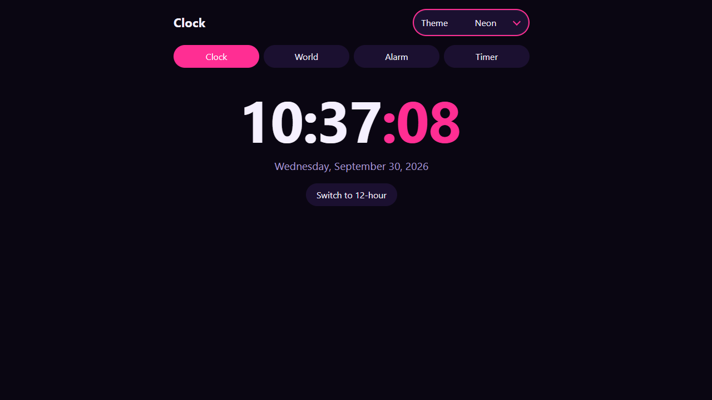

# Digital Clock

A multi-feature clock built with vanilla HTML, CSS and JavaScript (no frameworks, no build step).

## Features
- Live clock with 12/24-hour toggle
- World clocks (add/remove cities, saved between visits)
- Alarms with sound (Web Audio API, no audio files needed)
- Stopwatch with laps, and a countdown timer
- 6 themes: Light, Dark, Ocean, Sunset, Forest, Neon (saved between visits)

## Screenshot

## Concepts practiced
`setInterval`, `Date`, `Intl.DateTimeFormat`, DOM manipulation, `localStorage`, event listeners, Web Audio API, CSS variables.
